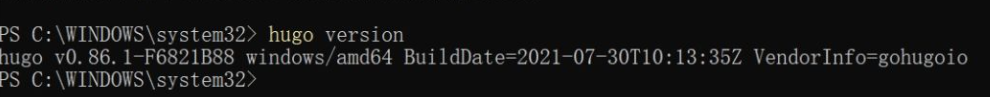
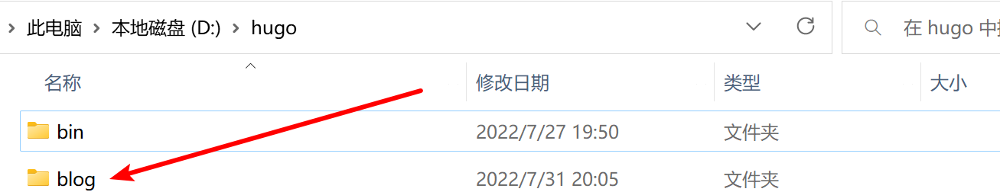

# 使用hugo生成静态博客并部署在GitHub上


hugo是一个用Go语言编写的静态网页生成器，只需要一个命令 hugo 就可以在几秒钟内生成一个静态的博客页面，被称为世界上最快的网站构建框架，使hugo称为最受欢迎且最热门的静态网站生成器之一。

<!--more-->

## hugo安装及配置
### hugo的下载
在[hugo的github页面](https://github.com/gohugoio/hugo/releases)中下载hugo版本(建议下载hugo_extended)
然后将hugo文件放在自定义的文件夹内（我在D盘创建了hugo文件夹并将hugo文件解压到D:\hugo\bin)


### hugo 安装验证
安装成功后验证一下，在命令行中输入
```
hugo version
```
如果出现
`hugo v0.86.1-F6821B88 windows/amd64 BuildDate=2021-07-30T10:13:35Z VendorInfo=gohugoio` 类似内容

则为成功安装



### hugo 配置
电脑搜索 `编辑系统环境变量` (或 右击windows中的此电脑，在选择框中选择属性->高级系统设置) 

然后 点击 `环境变量->系统变量->Path->编辑->新建` 然后输入自定义的文件夹的路径
 


## 建立博客与配置主题
右键文件夹内空白处 选择 在终端中打开
会出现 
### 搭建博客

建立博客名为blog
```
hugo new site blog
```
就会发现
继续在终端输入
```
cd blog
```
此时再输入 
```
hugo server
```
就可以通过 http://localhost:1313/ 来访问自己的博客（仅自己可访问）

### 主题
在 https://themes.gohugo.io/ （或其他地方） 找到自己喜欢的主题后 根据主题的说明自行安装

#### 此处以本站主题 Fixit 为例 
（本站后续更新关于Fixit主题美化教程）

首先在 [Fixit](https://github.com/hugo-fixit/FixIt/tags) 选择版本并下载（zip)


不要使用 **git clone https://github.com/hugo-fixit/FixIt.git**  这将会获得开发版本的Fixit


将文件解压到themes文件夹下(建议将fixity文件中exampleSite内容复制到根目录下)

### 部署到github上
#### 部署过程
省略
#### 命令
`baseURL = "https://lucasguake.github.io/"`
```
hugo    ##生成静态页面文件
cd public
git init    ##初始化仓库
git remote add origin https://github.com/lucasguake/lucasguake.github.io.git    ##链接远程仓库
git add .
git commit -m "first commit"
git push -u origin master
```
在此之后更新文章，使用hugo生成新的静态页面，并使用git push进行同步
```
hugo
cd public
git add .
git status
git commit -m "add blog post"
git push
```

如果最后一步git push出错 请用 ***git push -u origin master***  或开启加速器

